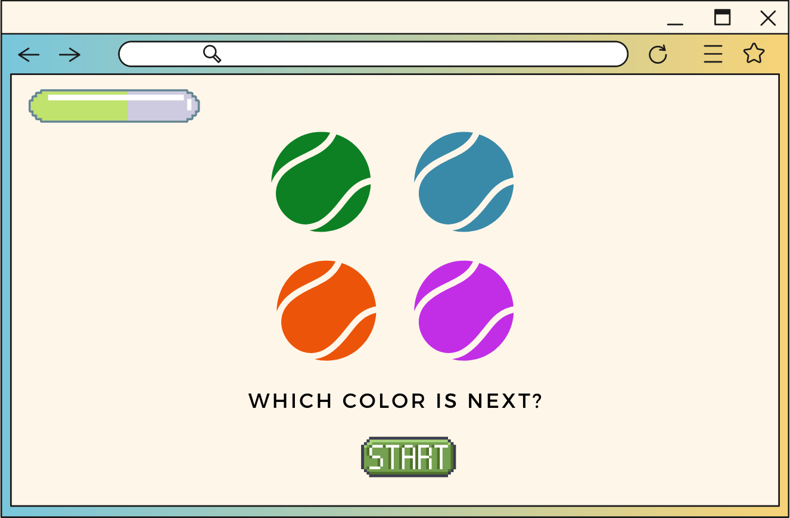

# Heidi Says
 ## Playing the game
 Heidi has had her ball fake thrown for the last time, and she's ready to get a bit of payback on her human (YOU). She has put together a game called Heidi Says. Are you smarter than this devious doggo? Test your skills at Heidi Says and find out!

 the goal of the game is to get as many ball colors correct as possible before the time runs out. Be warned, if you get too many wrong in a row Heidi will get impatient and slobber all over the ball and all over you. Game over. 

 TLDR: Guess the correct order of colors as they glow on the screen. You have three chances to get them all right. Guess an order wrong and you'll lose a patients point (life). 

Tech Stack: Html, CSS, Javascript

 

 ## MVP
- start button activates game start
- balls will glow once start button is pushed
- game remembers what order the glowed in to match player answers
- player can win after 5 rounds
- player can lose if they guess wrong three times
- hit points meter will decrease if you guess a wrong color
- message displays after the game signaling game win or lose
 

 ## Stretch Goals
 - screen glows red if you have 1 patients point left (Life)
 - music plays in background
 - balls will change color on next round
 - heidi running away gif upon game win
 - page gets "Slobbered" if you lose
 
