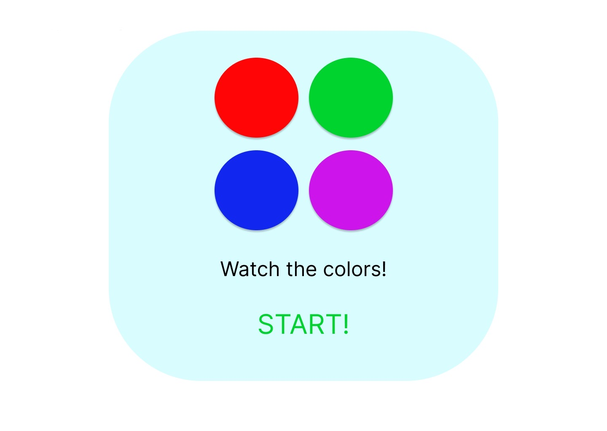

# Heidi Says

 ## Playing the game
 Heidi has had her ball fake thrown for the last time, and she's ready to get a bit of payback on her human (YOU). She has put together a game called Heidi Says. Are you smarter than this devious doggo? Test your skills at Heidi Says and find out!

## Game Goals
The goal of the game is to get as many ball colors correct as possible until the end of the rounds. Be warned, if you get it wrong Heidi will get impatient and run away with the ball. Game over. 

 TLDR: Guess the correct order of colors as they glow on the screen. You have infinite chances to get them all right. Guess an order wrong and heidi will take her tennis balls away and the game will be over. 

 ## Heidi Says
https://moodybleu.github.io/Heidi-Says/ 

## Approach
I started by building my wireframe to give me a good idea of what i want my final CSS and HTML to look like. After getting them mostly set up, i moved on to javascript. Unfortunately I was incredible overwhlemed by the prospect of figuring out the logic behind my game. So i turned to youtube to get and idea of the logic I would be writing. Once i had the bones in place, i did a lot of aesthetic tweaks to make the theme of my game really come to life. 

## Tech Stack
Html5, CSS, Javascript, DOM manipulation

 

 ## MVP
- power button turns "on" the game
- start button activates game start
- balls will glow once start button is pushed
- game remembers what order the glowed in to match player answers
- player can win after 20 rounds
- player can continue from lost level after wrong guess
- message displays after the game signaling game win or lose
 

 ## Stretch Goals
 - Hard mode makes you start from the beginning
 - gif of Heidi on the page during game play
 - music plays in background
 - balls will change to completely different colors on next round
 - Heidi running away gif upon game win
 - add cartoon running sound to Heidi gif
 - page gets "Slobbered" if you lose
 
## Post Project Reflection

I learned a lot trying to get this game to function. I had to use methods I wasn't too familiar with and roll with it. This really helped me learn that in the world of software development, there is no such thing as perfect. This was a hard lesson for me to swallow but I think in the end I was able to accept the outcome of my project and still appreciate the things I did do correctly. Even though my project is still buggy and probably only looks good on my own monitor, I'm still grateful for the problems I was able to solve and learn from. 

I plan on coming back to my game and adding to it once I feel a little more comfortable understanding javascript. I also have a handful of theme related content

## Sources
Youtube; 
W3Schools - varies pages;
MDN - varies pages;
Figma - wireframe design;
